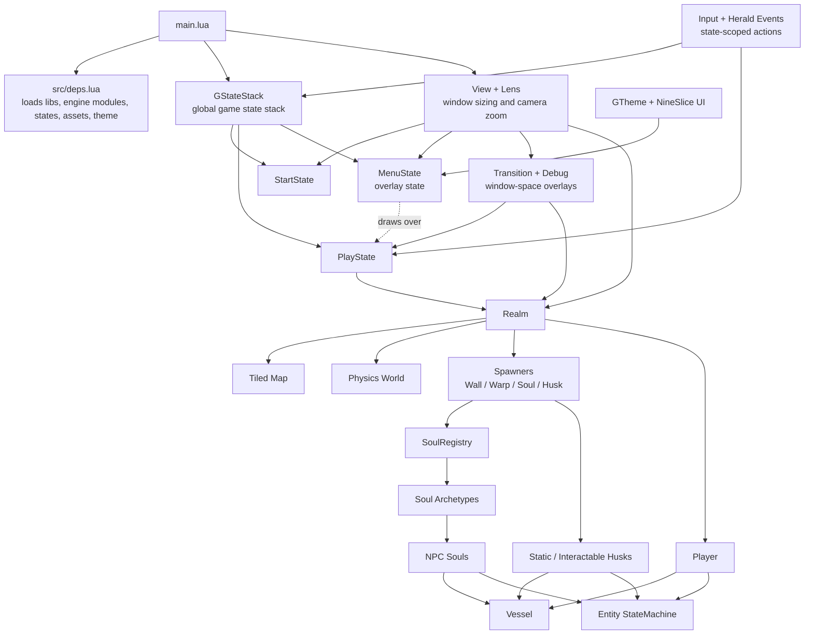

# Dalbit Ninja

*달빛 닌자*

> 달빛  /dal.bit/  n.  moonlight

A well-structured, thoroughly documented LÖVE (Love2d) project. This project contains many of the primitives needed to build up a GBA-style top-down game with a GBA-inspired presentation layer.

## Project Structure

### Architecture Overview



The project uses two main important concepts: Vessels and state-driven runtime flow.

### Vessels

Heavily inspired by the great Challacade (see References), all things that exist in the world as Box2D-backed objects are considered "Vessels". A Vessel is the shared physics/collision composition layer used by two higher-level world object types: "Soul", a moving entity such as the player or an NPC, and "Husk", a static or lightly animated world prop such as a chest or other interactable.

Souls and Husks do not inherit from `Vessel`; they *possess* one via `self.vessel` and expose `self.collider` as a convenience reference. The Vessel should encapsulate the physics and collision details so the owning entity can focus on gameplay behavior.

One should prefer to instantiate a new Soul or Husk through composition, not inheritance. In practice, it is usually better to define a new Soul or Husk where it is needed, rather than creating many subclasses for every new NPC or prop type.

### State Stack & State Machine

Heavily inspired by GD50 (see References), most of the game logic is controlled via state objects. At the top level, the game uses a global `StateStack` defined in `main.lua` to control screen-level flow such as the start screen, play state, and menu overlay. Separately, Souls and Husks each use their own `StateMachine` instances for local behavior such as idle, walk, wander, chase, or return-home transitions.

The benefit of using a state stack is that a new state can be pushed on top while lower states continue to render without updating. This is what allows `MenuState` to pause gameplay while still drawing `PlayState` underneath the menu panel. When the menu is popped, the underlying play state resumes exactly where it left off.

Each state module defines a `STATE_NAME` constant and assigns that value to `self.stateName` on instances. Use `self.stateName` when a state instance refers to itself, such as subscribing to its own state-scoped input event. Use `OtherState.STATE_NAME` when transitioning or referring to another state, and use `SomeState.STATE_NAME` as the key when registering state factories in a `StateMachine`.

### Conventions

#### Syntax checks

After completing Lua changes, run `luac -p` on the changed Lua files to catch syntax errors before running the game or handing off work.

#### LuaLS documentation

Always use LuaLS [annotations](https://github.com/LuaLS/lua-language-server/wiki/Annotations) to document functions.

Try to re-use the same description for the same fields (i.e. every `update(dt)` function should re-use the exact same description for the `dt` field docstring) for cleanliness.

#### OOP-style inheritance

When making classes that should inherit from another class, follow this structure:

Parent classes:

```lua
local ParentClass = {}
ParentClass.__index = ParentClass

---@generic T : ParentClass
---@param subclass? T
---@return T
function ParentClass.new(def, subclass)
	local self = setmetatable({}, subclass or ParentClass)
	self.exampleParentProperty = def.exampleParentProperty
	return self
end

return ParentClass
```

Child classes:

```lua
local ParentClass = require("path.to.parent.class")

local ChildClass = {}
ChildClass.__index = ChildClass
setmetatable(ChildClass, { __index = ParentClass })

-- The rest of the functions go here...

function ChildClass.new(def) -- add subclass too if needed
	local self = ParentClass.new(def, ChildClass)
	self.exampleChildProperty = def.exampleChildProperty
	return self
end

return ChildClass
```

Aim to use inheritance sparingly; it is only warranted when the child class truly adds or encapsulates a lot of unique logic. You should not, for example, create a new subclass for every single type of entity or object in the game when it could be instantiated by passing properties and behavior into the parent type.

When a constructor accepts a `subclass` metatable and returns that subtype, document it with a constrained LuaLS generic such as `---@generic T : ParentClass`, `---@param subclass? T`, and `---@return T`. Constructors that do not accept `subclass` should return their concrete class directly.

#### Class function ordering

In general, I prefer to order class functions like so for consistency:

1. Unique functions belonging to the class.
2. `update(dt)`; keep update and draw always at the bottom right above the constructor
3. `draw()`
4. `new()`; the "constructor" always goes at the bottom of the class

#### Events

Events are handled by the `Herald` module. Herald has three main functions: `hearken` to subscribe, `decree` to emit, and `muster` to define a group of subscriptions that can later be cleaned up together.

In general, events should not be used to orchestrate game logic, rather they should pass data between components to trigger actions or provide information.

Use a `muster` when a single file owns several related subscriptions or needs deterministic cleanup during `exitState()`.

Event names, centrally registered in `events.lua`, should adhere to the following pattern: `<scope>:<action>`.

If you subscribe within a State, make sure you unsubscribe when the state exits. Otherwise subscriptions will accumulate every time the state is re-entered.

#### Input

All keyboard input is handled via `input.lua`. In the current runtime model, `love.keypressed` forwards into `Input:keyPressed(key)`, which records single-frame presses and then routes most gameplay actions through a state-scoped `Herald.decree` using the current top state on `GStateStack`.

This routing is important. It prevents actions like interaction, menu toggling, or pause toggling from firing in the wrong state. For example, player interaction should only be requested when `PlayState` is the active top state, not while a menu overlay is active. Reserve truly global behavior for truly global input, such as the debug toggle. Note that `escape` currently exits the game globally.

#### Drawing

Any time you wish to draw something and you need to change the graphics state, wrap the draw logic in the `safeDraw` utility. This protects global state like color, font, blend mode, and transforms from leaking into the rest of the draw pipeline.

```lua
Util.safeDraw(function()
	love.graphics.setColor(0, 0, 0, 0.7)
end)
```

## Resources

- [Challacade](https://www.youtube.com/@Challacade)
- [GD50](https://youtube.com/playlist?list=PLhQjrBD2T383Vx9-4vJYFsJbvZ_D17Qzh&si=jj8o_NLrpyr_ezwn)
