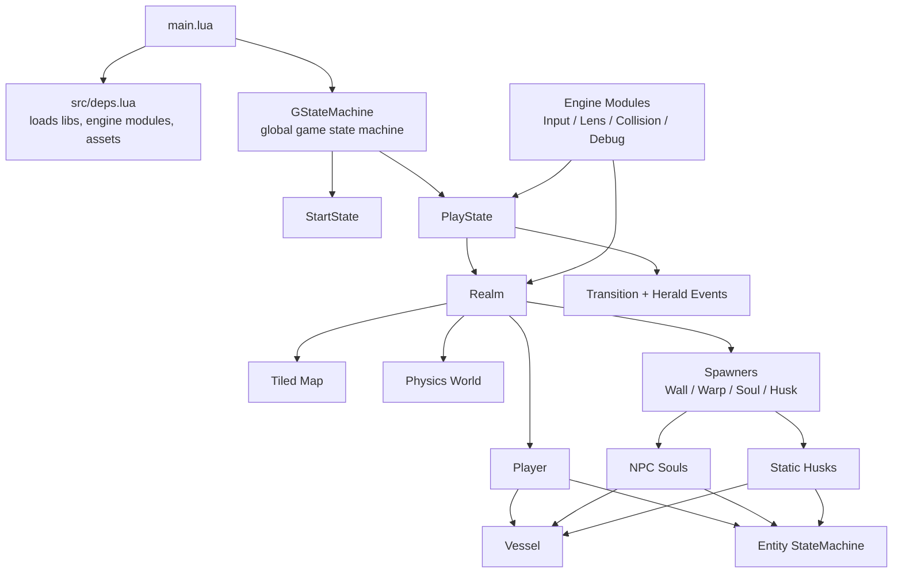

# lua-boy-advance

A well-structured, thoroughly documented LÖVE (Love2d) project. This project contains many of the primitives needed to build up a GBA-style 2D game (Pokémon, Zelda, Mario & Luigi: Superstar Saga, etc).

## Project Structure

The project uses two main important concepts: Vessels and StateMachines.

### Architecture Overview



### Vessels

Heavily inspired by the great Challacade (see References), all things that exist in the world (i.e. love.physics bodies) are considered "Vessels". A Vessel can belong of two types: "Soul", an entity which moves dynamically (i.e. the player or npcs), and "Husk", an object with physics properties that does not move dynamically (i.e. breakable boxes, trees, etc). Souls and Husks do not inherit from Vessel, rather they *possess* a vessel. A soul or husk's vessel should essentially encapsulate all of the physics/collision-related data and mechanics.

One should prefer to instantiate a new Soul or Husk through composition, not inheritence. Meaning, it's better to define the Soul or Husk where it is needed, rather than creating many subclasses for every new type of npc or object. 

### State Machine

Heavily inspired by GD50 (see References), most of the game logic is controlled via a state machine, or more precisely, a state stack. The game has a global state stack defined in `main.lua` which controls the overall state of gameplay (i.e. start state, play state, menu state, etc), whereas Souls and Husks can have their own state machine for controlling the various states they might be in irrespective of the global state (i.e. walk state, idle state, attack state, etc).

The benefit of using a state stack is that new states can be pushed on top of the stack while the previous state continues to render without updating (i.e. is "paused"). This allows for things like a Menu State, which when pushed to the stack pauses the play state but continues to render it underneath the menu (in the case of a floating UI) and preserves the data of the play state, such that when the menu is closed (Menu State is popped off the stack) the gameplay resumed exactly where left off (as opposed to creating a new, fresh play state).

### Conventions

#### LuaLS documentation

Always use LuaLS [annotations](https://github.com/LuaLS/lua-language-server/wiki/Annotations) to document functions.

Try to re-use the same description for the same fields (i.e. every `update(dt)` function should re-use the exact same description for the `dt` field docstring) for cleanliness.

#### OOP-style inheritence

When making classes that should inherit from another class, follow this structure:

Parent classes:

```lua
local ParentClass = {}
ParentClass.__index = ParentClass

function ParentClass.new(def, subclass)
	local self = setmetatable({}, subclass or ParentClass)
	self.exampleParentProperty = def.exampleParentProperty
	return self
end

return ParentClass
```

Child classes:

```lua
local ParentClass = require("path.to.parent.class")

local ChildClass = {}
ChildClass.__index = ChildClass
setmetatable(ChildClass, { __index = ParentClass })

-- The rest of the functions go here...

function ChildClass.new(def) -- of course, subclass should also be added if needed
	local self = ParentClass.new(def, ChildClass)
	self.exampleChildProperty = def.exampleChildProperty
	return self
end

return ChildClass
```

Aim to use inheritence sparingly; it is only warranted when the child class truly adds or encapsulates a lot of unique logic. You should not, for example, create a new subclass for every single type of entity or object in the game when they could have been instantiated by passing their properties to the parent class.

#### Class function ordering

In general, I prefer to order class functions like so for consistency:

1. Unique functions belonging to the class.
2. `update(dt)`; keep update and draw always at the bottom right above the constructor
3. `draw()`
4. `new()`; the "constructor" always goes at the bottom of the class

#### Events

Events are handled by the `Herald` module. Herald has three main functions: `hearken` (e.g. subscribe to an event), `decree` (e.g. emit an event), and `muster` (e.g. define a group of subscriptions to avoid boilerplate and be able to unsubscribe all of them at once).

In general, events should not be used to orchestrate game logic, rather they should pass data between components to trigger actions or provide information.

Use a `muster` if a single file needs to define three or more events.

Event names, centrally registered in `events.lua`, should adhere to the following pattern: `<scope>:<action>`.

#### Input

All keyboard input is handle via `input.lua`. In most cases, a keypress triggers a `Herald.decree` event emission, so that several subscribers can listen to this event and decide what to do. Be mindful of how you broadcast the events; if, for example, you globally emit a decree for the player interaction event, then the associated keypress will fire regardless of the game state. Meaning, if standing within range of an interactable item and pressing the interact key, the interaction would happen even if the game was paused or the menu was open, which is not expected behavior. Avoid these scenarios by emitting global events only for actions that should truly happen at any point in time/state (e.g. toggle debug HUD), and for non-global events (like triggering player<>object interaction) rather pass the data that "this event is requested" to the responsible class to determine if the action should be executed or not.

#### Drawing

Any time you wish to draw something and you need to change the color (e.g. for drawing colored text or shapes/outlines), wrap the draw logic in the `safeDraw` utility, which takes care of resetting the global color state, since `love.graphics.setColor()` affects the global state.

```lua
Util.safeDraw(function()
	love.graphics.setColor(0, 0, 0, 0.7)
end)
```

## Resources

- [Challacade](https://www.youtube.com/@Challacade)
- [GD50](https://youtube.com/playlist?list=PLhQjrBD2T383Vx9-4vJYFsJbvZ_D17Qzh&si=jj8o_NLrpyr_ezwn)
