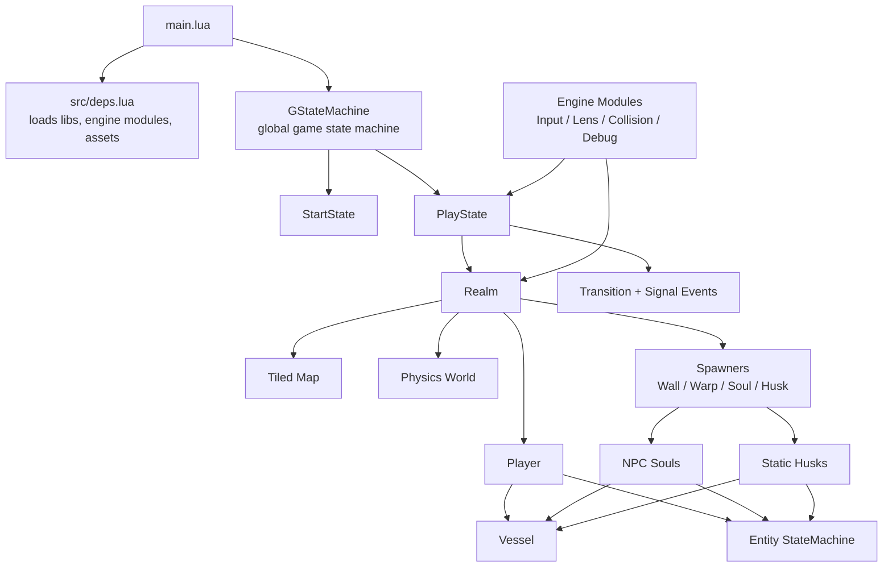

# lua-boy-advance

A well-structured, thoroughly documented LÖVE (Love2d) project. This project contains many of the primitives needed to build up a GBA-style 2D game (Pokémon, Zelda, Mario & Luigi: Superstar Saga, etc).

## Project Structure

The project uses two main important concepts: Vessels and StateMachines.

### Architecture Overview

### Vessels

Heavily inspired by the great Challacade (see References), all things that exist in the world (i.e. love.physics bodies) are considered "Vessels". A Vessel can belong of two types: "Soul", an entity which moves dynamically (i.e. the player or npcs), and "Husk", an object with physics properties that does not move dynamically (i.e. breakable boxes, trees, etc). Souls and Husks do not inherit from Vessel, rather they *possess* a vessel. A soul or husk's vessel should essentially encapsulate all of the physics/collision-related data and mechanics.

One should prefer to instantiate a new Soul or Husk through composition, not inheritence. Meaning, it's better to define the Soul or Husk where it is needed, rather than creating many subclasses for every new type of npc or object. 

### State Machine

Heavily inspired by GD50 (see References), most of the game logic is controlled via a state machine. The game has a global state machine controlling the overall state of gameplay, whereas Souls and Husks can have their own state machine for controlling the various states they might be in.

## Resources

- [Challacade](https://www.youtube.com/@Challacade)
- [GD50](https://youtube.com/playlist?list=PLhQjrBD2T383Vx9-4vJYFsJbvZ_D17Qzh&si=jj8o_NLrpyr_ezwn)
